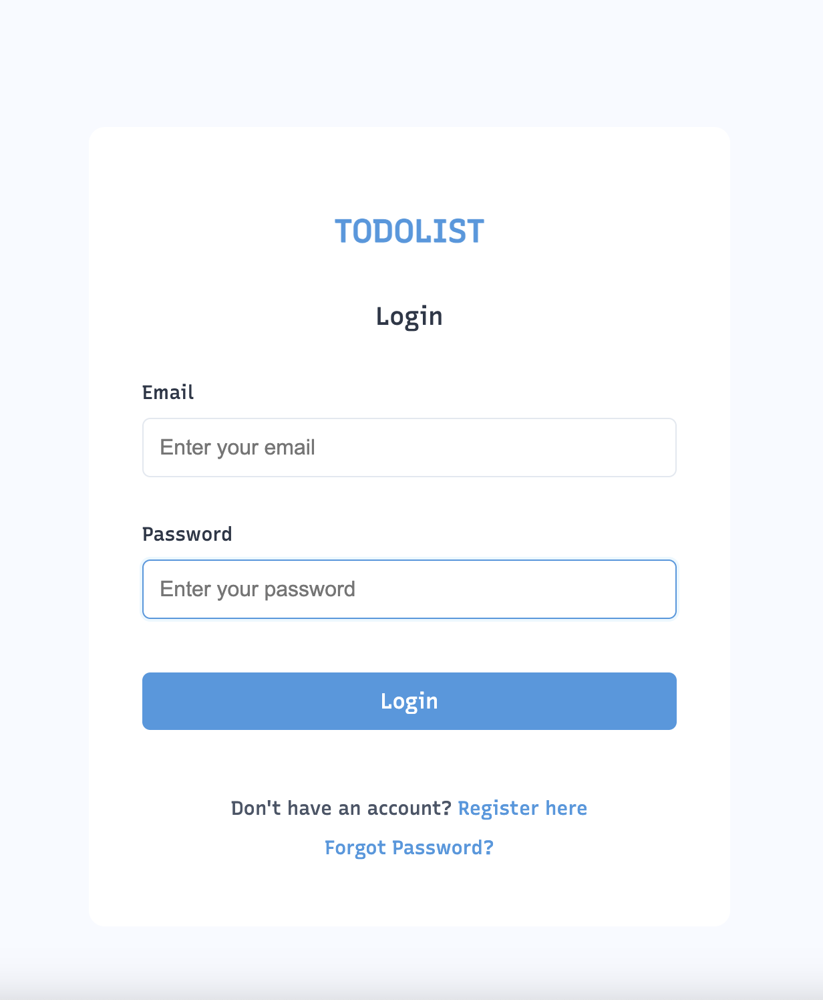
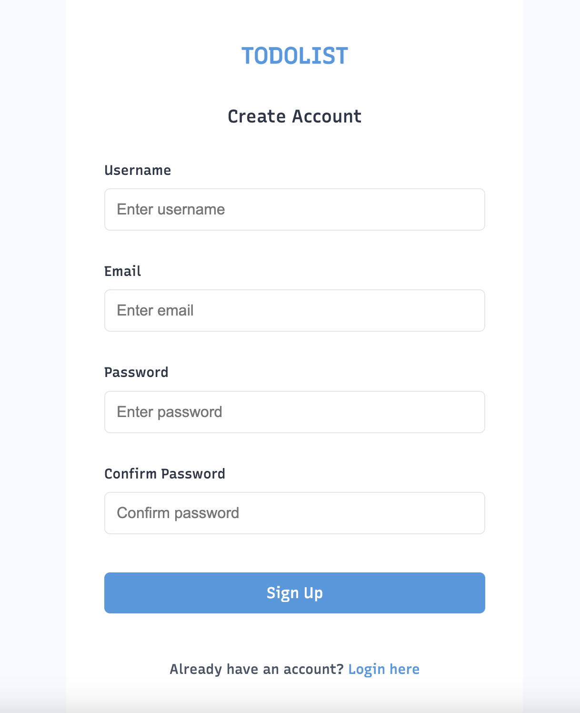
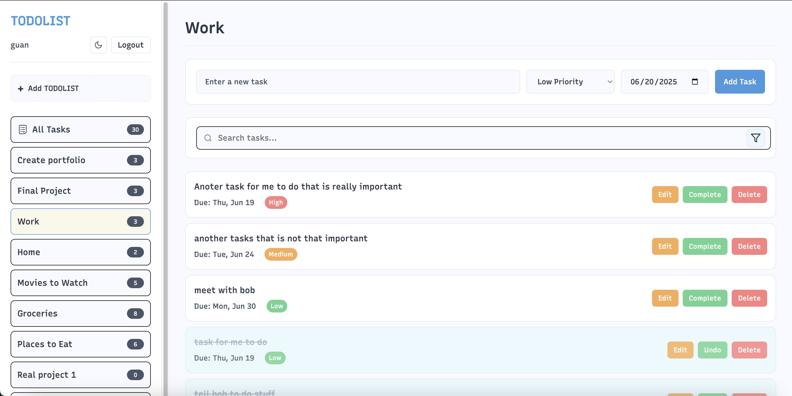
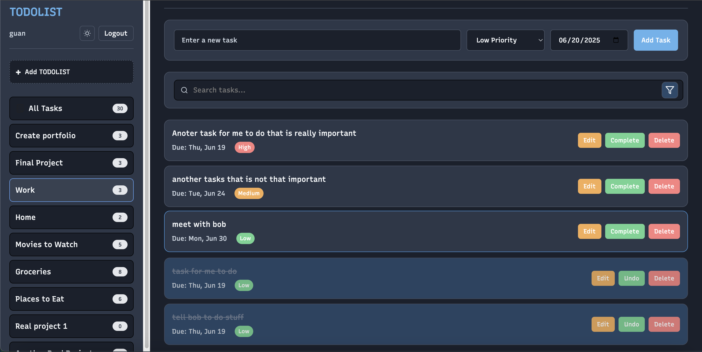

# TODOLIST Application

Todo list application built with JavaScript

## Description

This is a todo lists application made using javascript. It has several features including user authentication, todo lists, task filtering, and task editing/completion/deletion. It allows users to create an account, manage/create their own todo lists and add tasks with priorities and due dates.

## Getting Started

### Dependencies

* A modern web browser on any OS
* VS Code (with Live Server Extension or Python to launch app)

### Installing

1. Clone repo 
```
git clone https://github.com/glin19/todo-list-application.git
```
2. Go to project directory
```
cd todo-list-application
```
3. Open on local server 
    * I used VS Code's extentention Live Server
    * Python:
        * python -m http.server 8000
        * npx http-server
4. Open browser and you should see the app

## Preview

**Demo:** [https://todo-list-application-lg.netlify.app/](https://todo-list-application-lg.netlify.app/)

**Screenshots:**

##### Login Page


##### Registration Page


##### Main Todo List Page


##### Dark Mode


## Help

* Ensure you're running the app through a local server (not opening the HTML file directly)
* For login issues, try clearing your browser's local storage for the site

## Authors

Guan Lin

## Version History

* 0.1 (Initial Release)

## License

This project is licensed under the MIT License - see the LICENSE.txt file for details


